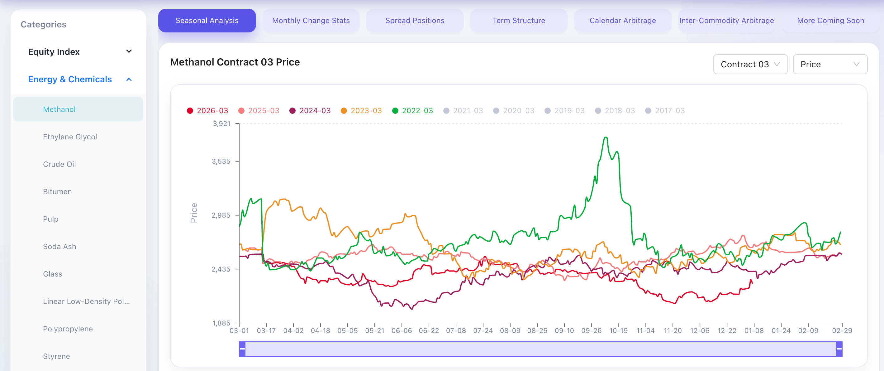

# Futures Dashboard Monorepo



This repository provides a full-stack futures analytics dashboard for exploring historical commodity contracts and spreads.

It includes:

- `web/`: a Next.js frontend with interactive filters, charts, and tables
- `api/`: a FastAPI backend that reads parquet datasets and serves normalized JSON payloads
- `data/`: source parquet files used for chart and table calculations

The dashboard currently supports these core views:

- Seasonal line chart by metric/category/contract month
- Term structure comparison snapshots (today, 1W, 1M, 3M, 6M, 1Y)
- Monthly change statistics table
- Calendar spread chart (near vs. far contracts)
- Inter-commodity spread chart (cross-category contract pair)

## Requirements

For local development:

- Node.js 20+ and `pnpm` ([nodejs.org](https://nodejs.org/), [pnpm.io](https://pnpm.io/))
- [`uv`](https://docs.astral.sh/uv/) for Python env/dependency management
- Python 3.11 runtime (installed automatically by `uv` if not already available)

For Docker launch:

- Docker Engine 24+ (or Docker Desktop) ([Install Docker](https://docs.docker.com/get-docker/))
- Docker Compose v2 (`docker compose`) ([Compose docs](https://docs.docker.com/compose/))

## Layout

- `web/`: Next.js + TypeScript frontend dashboard
- `api/`: FastAPI backend service
- `nginx/`: reverse proxy config for containerized launch
- `scripts/`: local/dev and non-Docker launch scripts

## Frontend (web)

```bash
cd web
pnpm install --frozen-lockfile
pnpm run dev
```

Open `http://127.0.0.1:3000`.

Other commands:

- `pnpm run build`
- `pnpm run start`
- `pnpm run test`
- `pnpm run lint`

## Backend (api)

```bash
cd api
uv sync
uv run uvicorn app.main:app --reload --host 127.0.0.1 --port 8000
```

If Python 3.11 is not present, `uv` will download and use a compatible interpreter automatically.

Open API docs at `http://127.0.0.1:8000/docs`.

Chart data endpoints include:

- Seasonal line chart: `/data/futures/{metric}/{category}/{contract}.json`
- Term structure chart: `/data/futures/term-structure/{category}/{YYYY}/{MM}/{DD}.json`
- Monthly change stats table: `/data/futures/monthly-change/{category}/{contract}.json`
- Calendar spread chart: `/data/futures/calendar-spread/{category}/{nearContract}/{farContract}.json`
- Inter-commodity spread chart: `/data/futures/inter-commodity-spread/{leftCategory}/{leftContract}/{rightCategory}/{rightContract}.json`

## Launch Both (Local Dev)

```bash
./scripts/launch.sh
```

This script starts:

- FastAPI at `http://127.0.0.1:8000`
- Next.js at `http://127.0.0.1:3000`

If either port is already in use, the script automatically picks the next available port.

## Docker Launch

Build and run all services (FastAPI + Next.js + NGINX):

```bash
docker compose up --build
```

Run in detached mode:

```bash
docker compose up -d --build
```

Open:

- App: `http://127.0.0.1:8888`
- API docs: `http://127.0.0.1:8888/api/docs`

Stop containers:

```bash
docker compose down
```

Optional overrides:

```bash
NGINX_PORT=8080 API_WORKERS=4 docker compose up -d --build
```

## Deploy Without Docker

```bash
./scripts/deploy.sh
```

Default ports:

- App at `http://127.0.0.1:8888`
- FastAPI at `http://127.0.0.1:8000` (proxied by Next.js under `/api`)
